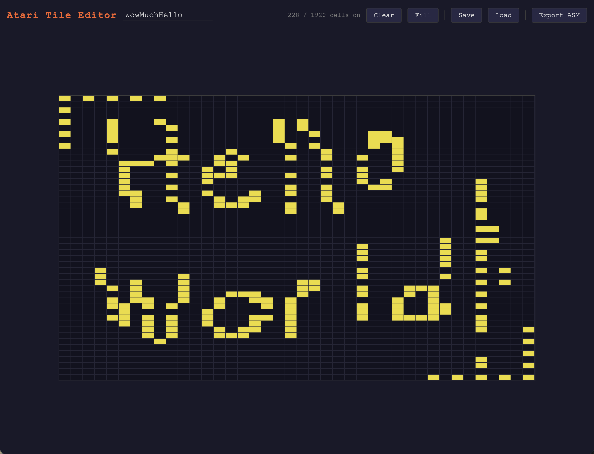
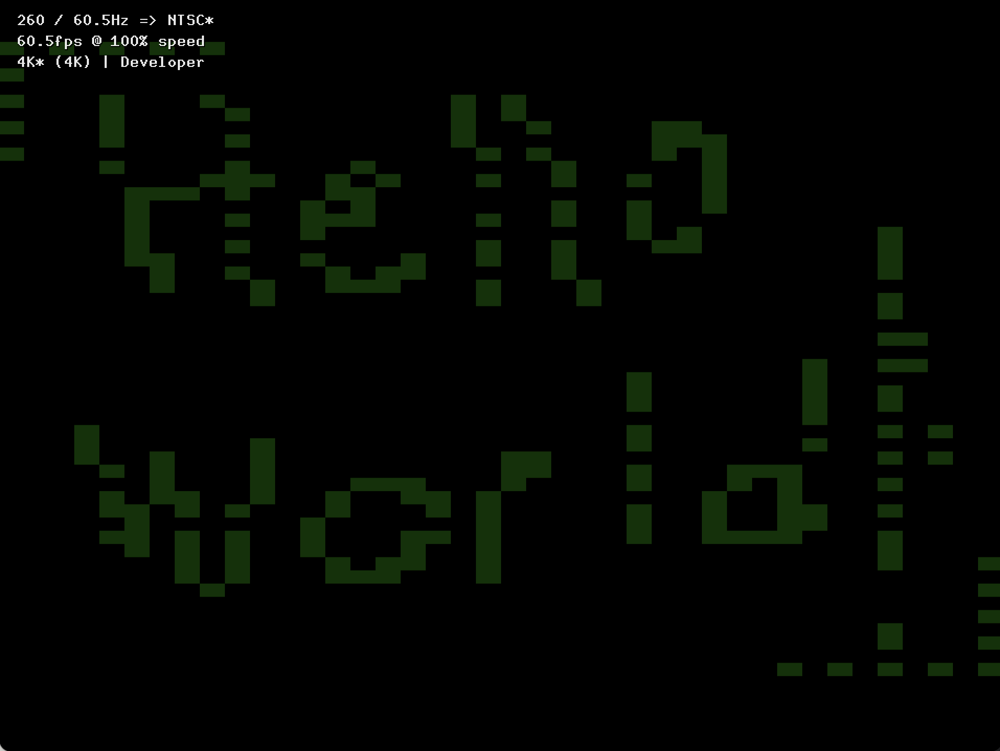

# Atari Tile Editor

A browser-based tile map editor for Atari 2600 games using a playfield-based tile engine.



## Sample Project

The `Sample/` directory contains a working Atari 2600 project (`helloworld3.asm`) that demonstrates the tile engine this editor targets, along with an exported tile map (`wowMuchHelloData.asm`) and the required header files.



### Tile Collision Detection

`Sample/tileCollision.asm` provides an `IsTileSet` subroutine for testing whether a given tile position is ON at runtime — useful for collision detection between sprites and the playfield.

```asm
    include "tileCollision.asm"

    ; Check if the tile at column 10, row 5 is set
    lda #10
    sta TileCheckCol
    lda #5
    sta TileCheckRow
    jsr IsTileSet
    bcs tileIsOn        ; carry set = tile is ON
```

To convert from raw screen coordinates:
```asm
    ; screenPixelX -> TileCheckCol
    lda screenPixelX
    lsr
    lsr
    sta TileCheckCol

    ; scanLine -> TileCheckRow
    lda scanLine
    lsr
    lsr
    sta TileCheckRow
```

The routine uses three 40-byte lookup tables (`ColBitmapLo`, `ColBitmapHi`, `ColBitMask`) to resolve the correct bitmap and bitmask for any of the 40 columns without branching. Update the bitmap label prefix in those tables to match your tile map name.

## Getting Started

```bash
npm install
npm run dev
```

Then open [http://localhost:5173](http://localhost:5173) in your browser.

## The Grid

The editor shows a **40×48** grid matching the tile engine's playfield layout:

- **40 columns** — 20 pixels per half of the screen (left and right)
- **48 rows** — each row corresponds to 4 scan lines (192 scan lines ÷ 4)
- Tiles are **2:1 rectangular** (twice as wide as tall), matching the Atari's pixel aspect ratio

Click or click-drag to toggle cells on and off.

## Toolbar

| Button | Action |
|--------|--------|
| **Clear** | Turn all cells off |
| **Fill** | Turn all cells on |
| **Save** | Download the tile map as a `.json` file |
| **Load** | Load a previously saved `.json` file |
| **Export ASM** | Export tile data as DASM-compatible assembly |

The tile name field (next to the title) sets the name used for file downloads and ASM label prefixes.

Work is automatically saved to `localStorage`, so refreshing the page restores your last session.

## Exporting to Assembly

**Export ASM** generates a `<name>Data.asm` file containing six bitmap tables compatible with the tile engine's rendering loop:

```
<name>Bitmap0  — left  PF0 (columns 0–3)
<name>Bitmap1  — left  PF1 (columns 4–11)
<name>Bitmap2  — left  PF2 (columns 12–19)
<name>Bitmap3  — right PF0 (columns 20–23)
<name>Bitmap4  — right PF1 (columns 24–31)
<name>Bitmap5  — right PF2 (columns 32–39)
```

Each table is 193 bytes. The rendering loop indexes with `Y` starting at 192 (top of screen) and decrementing to 145 (bottom), so editor row 0 maps to index 192 and row 47 maps to index 145. Bytes 0–144 are zeroed padding.

### Playfield Bit Encoding

| Register | Bit order | Notes |
|----------|-----------|-------|
| PF0 | LSB first (bit 4 = leftmost) | Upper nibble only; lower nibble ignored by hardware |
| PF1 | MSB first (bit 7 = leftmost) | All 8 bits used |
| PF2 | LSB first (bit 0 = leftmost) | All 8 bits used |

### Using the Exported File

In your game's assembly, include the exported file and update the bitmap label references to match the tile name:

```asm
    lda <name>Bitmap0,Y
    sta PF0
    lda <name>Bitmap1,Y
    sta PF1
    ; ...
```

## Save File Format

The `.json` save format is straightforward and human-readable:

```json
{
  "name": "my-tile",
  "cols": 40,
  "rows": 48,
  "cells": [[false, true, false, ...], ...]
}
```

`cells` is a 48×40 array of booleans (rows × columns), where `true` = pixel on.
